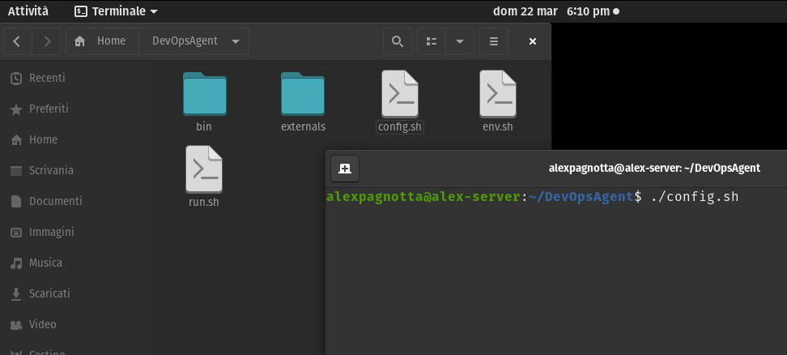

Da qualche settimana sto sviluppando una piccola API in Asp Net Core, che servirà come backend per un progetto personale che sto portando avanti, un'app in react native per il tracking dei libri.

L'Api è praticamente conclusa se non per qualche aggiustamento, ma essendo solo un backend per un progetto personale, non ho particolare interesse a rilasciarla sfruttando servizi come Heroku o Azure AppService, ho deciso quindi di tenerla in locale, sfruttando però le pipelines di DevOps e un "Home Server Linux" che utilizzo come Media Server, dove andrò ad eseguire l'api.

Uno degli scopi del progetto infatti è quello di prendere confidenza con alcune tecnologie per me nuove, principalmente AspNet Core, Entity Framework, Automapper, e per l'appunto DevOps sfruttando le Pipelines, cosi da poter automaticamente avere una versione sempre aggiornata dell'api pubblicata sul mio server, ad ogni commit effettuato.

Non ho trovato particolari difficoltà nel configurare la pipeline, si trovano infatti molte risorse online, compresa la documentazione ufficiale Microsoft, non ho trovato molto però per quanto riguarda l'installazione e la successiva configurazione dell'agent su Linux, Pop Os nel mio caso, per questo ho pensato di descrivere qua la procedura che ho utilizzato.

Darò per scontato che sia già presente una pipeline e una release pipeline parzialmente configurata, e mi concentrerò principalmente su quello che riguarda l'installazione dell'agent, e il collegamento con la Release Pipeline.

## Creare un Personal Access Token in DevOps

La prima cosa da fare è generare un nuovo "Personal Access Token", cosi da poterlo poi inserire in fase di installazione dell'agent, per farlo basterà collegarsi alla pagina di Azure DevOps dove è ospitato il progetto, cliccare nel menu in alto a destra del profilo ed accedere alla pagina "Personal Access Token" attraverso la voce nel menù.

A questo punto possiamo creare un nuovo token tramite il bottone in alto a sinistra, dove andremo ad inserire il nome, la data di scadenza del token, e gli scopes del token, qua bisognerà selezionare la checkbox "Read & Manage" dell'elemento "Agent Pools", visible andando a mostrare tutti gli elementi cliccando su "Show more scopes" in basso.

## Scaricare e installare l'Agent

A questo punto dobbiamo scaricare l'agent, per farlo basterà andare nell impostazione dell'organizzazione, cliccando nella voce "Organization settings" nella barra laterale,  selezioniamo poi la voce "Agent pools", "Default" e successivamente creiamo e scarichiamo un nuovo Agent tramite il bottone in alto a destra.

A questo punto nel server Linux scarichiamo il file dell'agent, spostandolo nella cartella dove vogliamo sia installato, e tramite terminale lo eseguiamo con il comando 

`./config.sh`

 comparirà ora la procedura guidata dove dovremo inserire il token precedentemente generato e l'url di Devops (https://dev.azure.com/NomeUtente).

Completata la procedura guidata, passiamo all'installazione e alla creazione del servizio Systemd, tramite il comando "./svc.sh", e infine all'esecuzione tramite il comando "sudo ./svc.sh start".

Tornando ora alla pagina Agent Pools in DevOps possiamo verificare che l'agent è attivo e funzionante.

## Configurare Release Pipeline

Una volta configurato correttamente l'agent, il prossimo passo è andarlo a settare come destinazione nella "Release Pipeline" , per farlo basterà andare nella pagina di modifica della pipeline, nella sezione Tasks, cliccando il secondo tab in alto.

A questo punto troveremo un Agent Job, a cui andrà settato il pool di default, e l'artifact che contiene i file pubblicati dell'api, una volta eseguito questo job andrà a scaricare, nella cartella in cui abbiamo installato l'agent, tutti i file dell'api  pronti per essere eseguiti.

Abbiamo quindi i file della nostra applicazione nel server,  quello che  ci serve ora è eseguire l'api come servizio sfruttando systemd , per farlo useremo tre task, uno per fermare il servizio nel caso fosse già avviato, un altro per spostare i file dell'applicativo in una cartella di nostra scelta, e infine un task per eseguire di nuovo il servizio, questa volta con i file aggiornati.

Il primo task è un task "Command Line", che andrà semplicemente ad eseguire il comando per far partire il servizio, nello specifico 

`sudo /usr/bin/systemctl stop NomeProgetto.service`

Il secondo Task invece è un "Copy File", che andrà a spostare i file dalla directory di default ad una cartella a nostra scelta, dovremo inserire quindi una cartella di destinazione, che sarà nel mio caso "/home/alexpagnotta/Programmazione/TestApi", e la cartella di default dove sono stati scaricati i file, qui possiamo usare una variabile che conterrà già il path predefinito $(Agent.BuildDirectory)", o indicare il path completo.

Ed infine l'ultimo task "Command Line" che andrà a far ripartire il servizio, con il seguente comando:

`sudo /usr/bin/systemctl start NomeProgetto.service`

## Conclusione

L'ultima cosa da fare è aggiungere le due stringhe seguenti al file sudoers.d utilizzando il comando "visudo" nel server linux:

`%LimitedAdmins ALL=NOPASSWD: /bin/systemctl start NomeServizio.service`

`%LimitedAdmins ALL=NOPASSWD: /bin/systemctl stop NomeServizio.service`

Cosi facendo evitiamo che venga richiesta la password all'esecuzione dei task command line da parte dell'agent, che altrimenti andrebbero a bloccare l'esecuzione.

A questo punto se tutto è stato configurato correttamente, una volta eseguita la pipeline, avremo un log che ci indica che tutti i task sono stati eseguiti correttamente, e la nostra api sarà correttamente avviata nel server.

