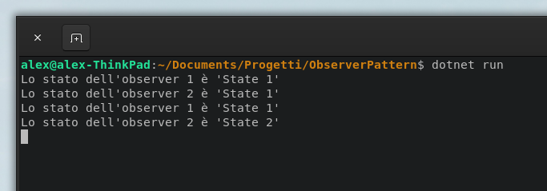

Dopo lo Strategy Pattern, il pattern successivo che il libro "Head Design Pattern" affronta è l'Observer Pattern.

Questo pattern permette di notificare eventuali "osservatori" di un cambio di stato avvenuto nel soggetto principale.

L'implementazione che ho sviluppato è composta principalmente da due attori, un "Subject" e degli "Observer", cioè un soggetto che ha un suo stato, e degli ossevatori che riceveranno una notifica ogni volta che lo stato del soggetto verrà modificato.

La classe Subject presenta due proprietà, uno stato, che nel mio caso è una semplice stringa, e una lista di Observers, che rappresenta la lista di osservatori in attesa di nostri aggiornamenti.
La struttura dei metodi è invece molto semplice, oltre ai metodi "AddObserver" e "RemoveObserver" che permettono aggiunta e rimozione degli observers dalla lista, e al metodo "GetState" che ritorna lo stato corrente, abbiamo "SetState" e "UpdateObserver".

Il metodo "SetState" ha la funzione di aggiornare lo stato con quello passato tramite parametro, e una volta aggiornato, chiamare il metodo "UpdateObservers", che si occupa invece di scorrere la lista degli observers e notificare ognuno del cambiamento di stato.

`embed:Subject.cs`

Abbiamo poi la classe "Observer", Abstract, che definisce proprietà e metodi che un observer deve avere, e delle implementanzioni concrete di due observer, con una struttura molto semplice, una proprietà che contiene l'attuale stato dell'observer, un metodo "GetState" che ritorna lo stato attuale, e un metodo "Update" che prende uno stato come parametro, e va ad aggiornare lo stato dell'observer.

`embed:Observer.cs`

Infine abbiamo il punto di ingresso della nostra console app, nel Program.cs, andiamo a inizializzare il Subject e i due observer,.
Per prima cosa aggiungiamo entrambi gli observer al nostro subject, e settiamo come stato "State 1", stampando il risultato vediamo come lo stato sia stato aggiornato in entrambi gli observer.
Andiamo poi ad eliminare il primo observer dalla lista nel Subject, e a settare il nuovo stato come "State 2", vediamo ora come andando a stampare di nuovo il risultato, solo il secondo subject presenta lo stato aggiornato, mentre il primo, non rientrando più nella lista degli observer, presenta ancora il vecchio stato "State 1".

`embed:Program.cs`

