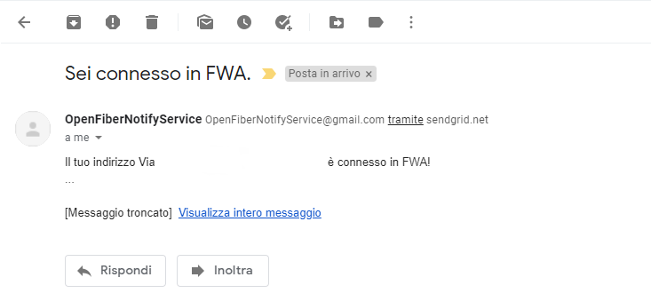
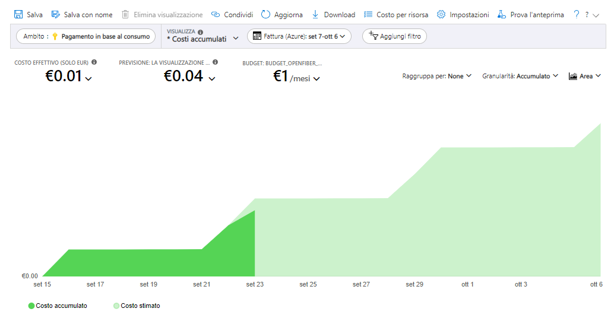

# Monitorare la propria copertura Open Fiber usando una Azure Function

Quest'anno dopo anni di attesa con una misera ADSL, anche nel mio piccolo paese è finalmente arrivata la connessione in Fibra grazie ad Open Fiber, chiaramente per tutto il paese tranne che per la mia via.

A seguito di varie peripezie che non starò qui a raccontare, ad oggi, dopo 6 mesi dalla richiesta di attivazione, sono ancora con la mia ADSL, principalmente per un errore nel DB di Open Fiber, che mostra la mia via come coperta con la tecnologia FWA (Wireless) invece che con tecnologia FTTH (Cavo), nonostante io abbia letteralmente il cavo in fibra ottica in salotto.

Sono quindi in attesa che Open Fiber sistemi questo errore e di conseguenza ormai controllare il sito di Open Fiber era diventato parte della mia routine mattutina.

Da programmatore l'idea di eseguire la stessa operazione manualmente ogni mattina mi ha subito fatto pensare "Automatizziamolo!",  in quel periodo inoltre stavo studiando per ottenere la certificazione AZ900 di Azure, per cui ho deciso di utilizzare una Azure Function, cosi da avere un pretesto per poter approfondire l'argomento.

## Come Funziona?

Lo scopo finale della function è quello di ottenere un informazione dalla pagina di copertura del sito Open Fiber, nello specifico alla fine otterrò un Enum che mi indica se l'indirizzo specificato é coperto, e nel caso con quale tecnologia, una volta ottenuto il dato deve mandare una mail con le informazioni ottenute.

Il primo passo è quindi andare a creare il progetto della Function, io ho utilizzato VSCode ma è possibile anche usare Visual Studio classico, specificando che si deve avviare ad un determinato orario tramite il TimerTrigger.

TODO SCRIVERE MEGLIO!!!!   Non andrò nel dettaglio su come creare una function e sull'implementazione vera e propria, in quanto il mio scopo è principalmente mostrare la logica dietro la function,  personalmente ho usato questo tutorial per iniziare. LINK, inoltre il codice completo della function è disponibile sul mio profilo [GitHub](https://github.com/AlexPagnotta/OpenFiberAzureFunction).

Una volta che la struttura della function è pronta, passiamo ad effettuare il parsing della pagina, per andare ad ottenere una stringa specifica che mi indica la copertura dell'indirizzo inserito, per fare questa operazione utilizzo la libreria [AngleSharp](https://anglesharp.github.io/) , che in modo molto semplice mi ha permesso di ottenere il dato necessario, semplicemente passandogli l'url della pagina e l'identificativo dell'elemento HTML da prendere.

Una volta ottenuta la stringa dalla pagina web, la vado a trasformare in un Enum cosi da poterlo gestire più comodamente, questo Enum avrà tre opzioni in base a copertura e tecnologia disponibile, nello specifico FTTH, FWA e Nessuna Copertura.

A questo punto non mi resta altro che inviare un email al mio indirizzo di posta elettronica,  contenente l'informazione ottenuta, per farlo utilizzo il servizio [SendGrid](https://sendgrid.com/) e di conseguenza la sua libreria all'interno dell'applicazione.

L'utilizzo di [SendGrid](https://sendgrid.com/) è estremamente semplice, basterà infatti iscriversi al servizio, gratis per un utilizzo non troppo intensivo, inserire tutti i dati richiesti, come l'indirizzo che useremo per inviare la mail, e ottenere la chiave API che andremo poi ad inserire all'interno dell'applicazione.

Ora dovremo solo installare il pacchetto Nuget di SendGrid all'interno del progetto, inizializzare il client specificando Api Key e indirizzo di destinazione, creare la struttura della mail andando a inserire oggetto e corpo del messaggio, e infine procedere all'invio.

## Costi 

Per quanto riguarda il fattore costi, l'unico servizio che dovremo pagare sarà la Function di Azure, in quanto SendGrid per uno uso base è totalmente gratuito.

La Function ha un costo in base al consumo, che è in realtà gratuito sotto il milione di esecuzioni, dovremo però andare a pagare lo storage collegato alla function, ed eventualmente Application Insight se volete attivarlo, io attivando entrambi ho un costo stimato di circa 4 centesimi al mese, direi quindi un costo trascurabile.

*P.S Io ho deciso di utilizzare una Azure Function principalmente per necessità di apprendimento, non è detto sia la soluzione migliore o più economica.*

## Conclusione 

Il codice completo della function è disponibile sul mio profilo [GitHub](https://github.com/AlexPagnotta/OpenFiberAzureFunction).

