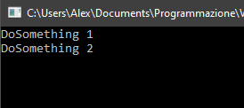

Da qualche giorno, sfruttando le ferie natalizie, ho deciso di iniziare a leggere il libro "Head First Design Patterns", per avere un'idea di quali sono e di come sfruttare i design patterns.

Il libro contiene vari patterns, i piu famosi e utlizzati, e ho pensato che semplicemente leggendo e studiandolo non avrei compreso a pieno il funzionamento e il come implementarli in progetti reali, ho deciso quindi per ogni pattern analizzato nel libro, di implementarlo in un piccolo progetto di test, e di inserirlo in un post del blog.

Il primo pattern affrontato nel libro è lo "Strategy Pattern", la sua funzione è quella di poter cambiare dinamicamente l'algoritmo usato in un metodo di una classe.

L'implementazione di test che ho scritto, è composta da varie classi, la prima consiste nel definire due strategie, "Strategy1" e "Strategy2", e la classe abstract che definisce la struttura "StrategyAbstract".
La classe abstract ci dice che tutte le strategie dovranno avere un metodo "DoSomething()", che nel mio caso stampa un messaggio diverso per ogni strategia.

`embed:Strategies.cs`
`embed:StrategyAbstract.cs`

L'ultima classe è lo "StrategyContext", la classe che si andrà effettivamente ad usare e chiamare nel programma.
Questa classe ha due metodi, SetStrategy() e PerformDoSomething(), oltre che avere una proprietà private che inidica la strategia corrente.

Il primo metodo permette di settare la strategia che si vuole utilizzare nella classe, prende infatti come parametro un oggetto di tipo "StrategyAbstract".

Il secondo metodo invece, è quello che effettivamente eseguirà l'algoritmo, andando a richiamare il metodo giusto in base alla strategia settata.

`embed:StrategyContext.cs`

Infine abbiamo il programma vero e proprio, qui vengono definite le strategie e il context, verrà quindi eseguito il metodo PerformDoSomething() due volte, prima con una strategia e poi con l'altra, cosi facendo verrano stampati i due messaggi diversi.

`embed:Program.cs`

